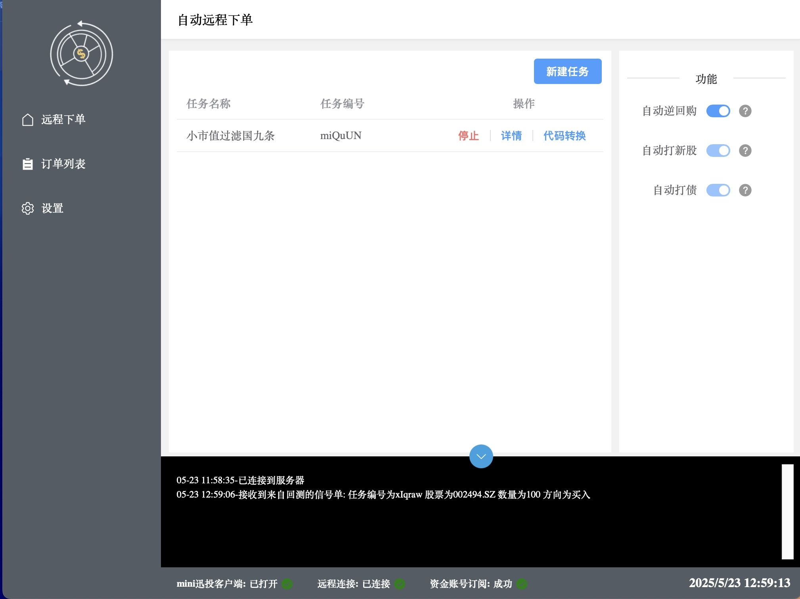

<div align="center">
  
  <div>&nbsp;</div>
  <span><font size="5">qmt远程自动下单程序</font></span>
</div>

## 项目简介

基于pywebview开发的一款能在回测平台(暂时支持聚宽)发送下单信号，收到信号后在qmt进行本地下单。使用本程序旨在简化自动下单流程，免去代码，让用户友好操作。


## 声明

`
    本项目在快速更新迭代中，可能会有未知的情况出现问题造成下单失败 后续稳定会上传安装包到releases
`

`
    使用本软件需要开通joinquantVip会员模拟回测功能和含QMT功能证券账号，如未开通可到文章下方添加微信咨询开通（声明：仅做微信推荐与本人无任何利益）
`

## 界面截图



## 功能特点


- 用户友好的界面
- 自动打新打债逆回购功能
- 一键转换代码功能 复制->粘贴 完成代码的转换
- token验证确保信号安全
- 支持多策略运行
- 查看受理订单
- 支持自建服务器搭建/私有服务器
- 后端使用go高性能服务作为支持
- 后端有重发机制确保发出信号安全


## 技术栈
- python 3.9+
- pywebview 6.0+
- nodejs 22+
- vue 3.0+
- element-plus 2.3+
  
## 下载

尚未提交安装应用包后续会打包上传，如需可下方联系作者获取

**若无法打开程序/白屏请下载webview2** 后重新打开

[webview2下载地址](https://developer.microsoft.com/zh-cn/microsoft-edge/webview2/)

## 开发说明

1. 克隆仓库
```   
    请自行安装nodejs >= 20.0 python >= 3.8
```
   
2. 克隆仓库

```bash
git clone https://github.com/kupple/qmt-remote-auto-order
```

3. 初始化/运行/打包

```bash
# 安装依赖
npm run init

# 运行开发模型
npm run start

# 打包应用
npm run build

```

## TODO
- 接入更多平台如掘金量化，SuperMind
- 接入easytrader
- 按金额比例数量下单
- 添加分红计算拆股功能

## 感谢

 [PPX](https://github.com/pangao1990/PPX)是一款基于pywebview和PyInstaller框架，构建macOS、Windows和Linux平台客户端的应用框架。

  
## 联系方式

如有问题或建议，请提交 Issue 或 Pull Request。 

加入量化讨论群 （不是群主仅作为友情链接邀请）

开通qmt权限(无门槛/低佣金)可添加

有偿搭建私有服务器支持可联系


数据库文件路径
/Users/zhao/Library/Application Support/qmt.auto.order.qmt_auto_order/static/db/base.db