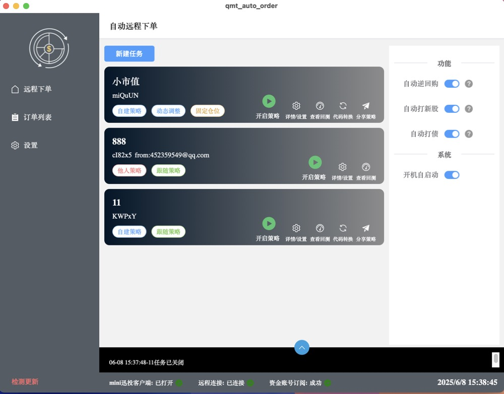

<div align="center">
  
  <div>&nbsp;</div>
  <span><font size="5">qmt远程自动下单程序</font></span>
</div>

## 项目简介

基于pywebview开发的一款能在回测平台(暂时支持聚宽)发送下单信号，收到信号后在qmt进行本地下单。使用本程序旨在简化自动下单流程，免去代码，让用户友好操作。


## 声明

`
    本项目在快速更新迭代中，可能会有未知的情况出现问题造成下单失败
`

`
    使用本软件需要开通joinquantVip会员模拟回测功能和含QMT功能证券账号，如未开通可到文章下方添加微信咨询开通（声明：仅做微信推荐与本人无任何利益）
`

## 界面截图



## 功能特点


- 新增分享策略功能可以将策略分享码分享给其他人(推荐使用动态仓位模式)
- 支持多策略运行
- 用户友好的界面
- 自动打新打债逆回购功能
- 异步下单方式更快的响应速度
- 一键转换代码功能 复制->粘贴 完成代码的转换
- token验证确保信号安全
- 查看受理订单
- 支持自建服务器搭建/私有服务器
- 后端使用go高性能服务作为支持
- 后端有重发机制确保发出信号安全


## 仓位模式解析
有2种仓位模式，按需选择

### 1.跟随策略端模式

    完全跟随策略端下单模式，使用此模式不能完整查看回测信息 不能统计最后资金情况和手续费相关，请在策略端填写实际券商的手续费

  - 优点：逻辑简单快捷，代码较少逻辑对比另外一种策略会稍微微快一点点
  - 缺点：策略开启后不能很好的动态管理，不能修改持仓信息，若需要需要自行重启策略端

### 2.动态调整模式

    动态调整模式有2种模式，一种是固定资金模式，还有动态计算资金模式，2种区别在于固定资金模式分配的资金永远不变比方说设置了5w初始资金，以后会下单股票不会超过5w市值去下单。另外一种总市值会根据股票下单的变动而变动。
    

  - 优点：可以与策略端的金额完全不一致按市值百分比进行下单，可以随时修改仓位和可有资金，操作性强。如果接入别人的分享策略请使用此模式
  - 缺点：实现逻辑较上面模式复杂一些 未进行实盘测试 😅

## 目前发现问题

- 实盘下单上海证券发行的ST退市风险股票市价单不会下单(未解决，会采用压低价格的方式限价单)
- 动态调整模式在调式模式测试过很多次（动态计算价格可以与平台价钱保持一致） 但是在实盘模式未实际运行过，请斟酌考虑
- 未进行股票的分红拆股重新计算仓位和价格 如果使用动态调整模式 当持仓股票发生分红会对下单数量可能有影响（未解决，后面会解决）
  
## 已测试

- 打新，逆回购
- 跟随策略模式对订单买卖


## 技术栈
- python 3.9+
- pywebview 6.0+
- nodejs 22+
- vue 3.0+
- element-plus 2.3+
  
## 下载

[widnow 安装包](https://github.com/kupple/qmt-remote-auto-order/releases)

[本地服务端](https://github.com/kupple/qmt-remote-auto-order/releases)

**若无法打开程序/白屏请下载webview2** 后重新打开

[webview2下载地址](https://developer.microsoft.com/zh-cn/microsoft-edge/webview2/)

## 开发说明

*可以在mac上运行但不能实盘下单，可以作为开发环境。*

1. 克隆仓库
```   
    请自行安装nodejs >= 20.0 python >= 3.8
```
   
2. 克隆仓库

```bash
git clone https://github.com/kupple/qmt-remote-auto-order
```

3. 初始化/运行/打包

```bash

# 新建.env 
mv .example.env .env

# 安装依赖
npm run init

# 同步数据库
npm run alembic

# 运行开发模型
npm run start

# 打包应用
npm run build

```

## TODO
- 修复上海st不能下市价单的问题
- 接入更多平台如掘金量化，SuperMind
- 接入easytrader
- 添加分红计算拆股功能  
- ~~按金额比例数量下单~~

## 感谢

 [PPX](https://github.com/pangao1990/PPX)是一款基于pywebview和PyInstaller框架，构建macOS、Windows和Linux平台客户端的应用框架。

  
## 联系方式

如有问题或建议，请提交 Issue 或 Pull Request。 

<!-- 加入量化讨论群 （不是群主仅作为友情链接邀请） -->

开通qmt权限(无门槛/低佣金)可添加(申明：仅做推荐与本人暂无任何利益关系！)
<!-- 有偿搭建私有服务器支持可联系 -->


